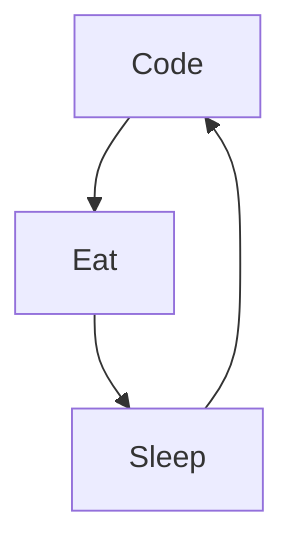

# Hi there 

## 🚀 About Me

🎓 I am Naquo, a **Full Stack Web Developer**. I am currently searching for projects in order to gain professional experience.

👨‍💻 I contribute to some Open Source Projects when I can.

## 🛠️ Skills

### Frontend
!https://cdn.jsdelivr.net/gh/devicons/devicon/icons/html5/html5-original.svg
!https://cdn.jsdelivr.net/gh/devicons/devicon/icons/css3/css3-plain-wordmark.svg
!https://cdn.jsdelivr.net/gh/devicons/devicon/icons/sass/sass-original.svg
!https://cdn.jsdelivr.net/gh/devicons/devicon/icons/javascript/javascript-original.svg
!https://cdn.jsdelivr.net/gh/devicons/devicon/icons/react/react-original.svg

### Backend
!https://cdn.jsdelivr.net/gh/devicons/devicon/icons/django/django-plain-wordmark.svg

### Tools
!https://cdn.jsdelivr.net/gh/devicons/devicon/icons/git/git-original.svg
!https://cdn.jsdelivr.net/gh/devicons/devicon/icons/vscode/vscode-original.svg

## ⭐ Stats

