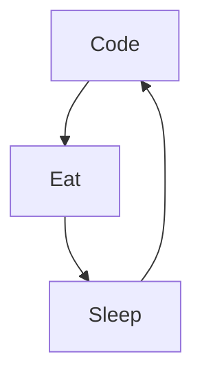

# Hi there 

## 🚀 About Me

🎓 I am Naquo, a **Full Stack Web Developer**. I am currently searching for projects in order to gain professional experience.

👨‍💻 I contribute to some Open Source Projects when I can.

## 🛠️ Skills

### Frontend
![HTML]
![CSS]
![SCSS]
![JavaScript]
![React]

### Backend
![Django]
          

### Tools
![Git]
![VSCode]

## ⭐ Stats

